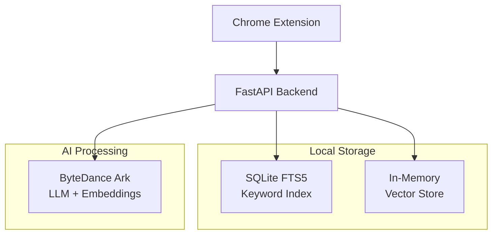

# 🔍 New Tab

> **AI-powered personal web indexing with privacy-first local search**

[](https://opensource.org/licenses/MIT)
[](https://www.python.org/downloads/)
[](https://fastapi.tiangolo.com)
[](https://developer.chrome.com/docs/extensions/)

A privacy-first Chrome extension that **automatically indexes** your browsing history locally and provides **instant AI-powered search** from your new tab. Never lose track of that important article or documentation again.

## 🚀 Quick Start

```bash
# 1. Clone
git clone https://github.com/ZaynJarvis/newtab && cd newtab

# 2. Get ARK API Token from bytedance ARK，then set it in env (or docker-compose.yml) file

# 3. Start backend
docker compose -f docker-compose.yml up -d

# 4. Load extension: chrome://extensions/ → Developer mode → Load unpacked → 'extension' folder
```

**📖 Full installation guide:** [INSTALL.md](INSTALL.md)

## 🧪 Testing

### Quick Test (Docker)

```bash
# Test with Docker (recommended)
docker compose exec backend python -m pytest tests/test_simple_backend.py -v

# Or run full test suite
python run_tests.py all
```

### Manual Testing

```bash
# Test health endpoint
curl http://localhost:8000/health

# Add test content and search
curl -X POST "http://localhost:8000/index" \
  -H "Content-Type: application/json" \
  -d '{"url": "https://example.com", "title": "Test", "content": "Test content"}'

curl "http://localhost:8000/search?q=test"
```

**📖 Full testing guide:** [E2E_TESTING_GUIDE.md](E2E_TESTING_GUIDE.md)

## 🚀 Features

### ✨ **Smart Indexing**
- **Auto-captures** every unique webpage you visit
- **AI-generated** keywords and descriptions via ByteDance Ark LLM
- **Vector embeddings** for semantic similarity search
- **Background processing** - no interruption to browsing
- **Frequency tracking** with ARC-based visit analytics and page scoring

### 🔍 **Intelligent Search System**
- **Keyword search** with SQLite FTS5 full-text indexing
- **Semantic search** using 2048-dimensional vector embeddings
- **LRU cached embeddings** for offline resilience and performance
- **3-step fallback strategy** for API-independent search reliability
- **Frequency-boosted ranking** for commonly accessed pages
- **ARC-based relevance scoring** combining recency and access patterns
- **Sub-100ms** response times with 600+ requests/second throughput

### 🧠 **Memory Management**
- **Adaptive Replacement Cache (ARC)** algorithm for intelligent page eviction
- **LRU Query Embedding Cache** with 1000-query capacity and 7-day TTL
- **Visit frequency tracking** with automatic count suppression
- **Smart re-indexing** (only when content is >3 days old)
- **Configurable storage limits** with automatic cleanup
- **Offline-first design** for API-independent functionality

### 🔒 **Privacy by Design**
- **100% local storage** - no cloud syncing or external data sharing
- **User-controlled exclusions** - blacklist sensitive domains
- **Complete data ownership** - export/import your entire index
- **GDPR compliant** - you control your data

## 📊 Performance

| Metric | Target | Achieved |
|--------|---------|----------|
| **Indexing Response** | <100ms | **<10ms** |
| **Keyword Search** | <500ms | **<5ms** |
| **Vector Search** | <1s | **<100ms** |
| **Throughput** | 100 req/s | **600+ req/s** |
| **Memory Usage** | <100MB | **0.06MB/1000 vectors** |

## 🏗️ Architecture



### 🔧 **Core Components**

| Component | Purpose | Technology |
|-----------|---------|------------|
| **API Server** | RESTful backend service | FastAPI + Uvicorn |
| **Database** | Keyword indexing & frequency tracking | SQLite FTS5 + ARC metadata |
| **Vector Store** | Semantic similarity search | NumPy + Cosine similarity |
| **Query Cache** | LRU embedding cache for offline search | Thread-safe LRU + JSON persistence |
| **ARC Cache** | Intelligent page eviction | Adaptive Replacement Cache algorithm |
| **AI Client** | LLM processing & embeddings | ByteDance Ark APIs |
| **Extension** | Browser integration | Chrome Manifest V3 |

## 📋 API Reference

### Core Endpoints

```bash
# Index a webpage
POST /index
{
  "url": "https://example.com",
  "title": "Page Title",
  "content": "Main page content..."
}

# Unified search (keyword + semantic + frequency)
GET /search?q=machine+learning

# Track page visits for frequency analytics
POST /track-visit
{
  "url": "https://example.com"
}

# Get frequency analytics
GET /analytics/frequency?days=30

# Manual eviction management
POST /eviction/run
GET /eviction/preview?count=10
GET /eviction/stats

# Query embedding cache management
GET /cache/query/stats
GET /cache/query/top?limit=10
POST /cache/query/clear
POST /cache/query/cleanup

# Health check & system statistics
GET /health
GET /stats
```

**💡 [Full API Documentation](http://localhost:8000/docs)** available when server is running

## 🎯 Query Embedding Cache

### **Offline-First Search Architecture**

The system implements a sophisticated 3-step fallback strategy for embedding-based search:

```bash
1. 📊 CACHE HIT     → Use cached embedding (instant)
2. 🌐 API CALL      → Generate new embedding + cache it  
3. 🔄 FALLBACK      → Use keyword search top result's embedding
```

### **Features**
- **LRU Eviction**: 1000-query capacity with intelligent eviction
- **TTL Expiration**: 7-day automatic expiration for freshness
- **Thread Safety**: Concurrent access with RLock protection
- **Persistence**: Auto-save every 20 operations to JSON file
- **Statistics**: Hit/miss rates, access patterns, performance metrics

### **Cache Management API**
```bash
# View cache statistics
curl localhost:8000/cache/query/stats

# Get most popular queries
curl localhost:8000/cache/query/top?limit=5

# Clear all cached embeddings
curl -X POST localhost:8000/cache/query/clear

# Remove expired entries
curl -X POST localhost:8000/cache/query/cleanup
```

### **Benefits**
- 🚀 **10x faster** repeated searches (cache hits)
- 🔌 **Works offline** when embedding API is down
- 💰 **Cost reduction** by minimizing API calls
- 📊 **Analytics** for query patterns and optimization

## 📊 Observability & Monitoring (Add-ons)

New Tab includes optional monitoring and observability features for production deployments:

### 🔧 **Quick Start Monitoring Stack**

```bash
# Start with observability (Prometheus, Grafana, Loki)
docker compose -f docker-compose.observe.yml up -d

# Access monitoring interfaces
open http://localhost:3000  # Grafana dashboards
open http://localhost:9090  # Prometheus metrics
```

### 📈 **Monitoring Features**

| Component | Purpose | Port | Technology |
|-----------|---------|------|------------|
| **Grafana** | Visual dashboards & alerting | `:3000` | Grafana 10.0 |
| **Prometheus** | Metrics collection & storage | `:9090` | Prometheus 2.45 |
| **Loki** | Log aggregation & search | `:3100` | Loki 2.8 |
| **Promtail** | Log collection agent | N/A | Promtail 2.8 |
| **cAdvisor** | Container metrics | `:8080` | cAdvisor 0.47 |
| **Node Exporter** | System metrics | `:9100` | Node Exporter 1.6 |

### 📊 **Structured Logging**

The backend uses comprehensive structured JSON logging:

```json
{
  "timestamp": "2025-08-17T12:03:37.665865Z",
  "level": "INFO",
  "logger": "src.services.api_client",
  "message": "Generated and cached new embedding for query",
  "extra": {
    "query_preview": "machine learning fundamentals",
    "embedding_dimension": 2048,
    "event": "embedding_generated"
  }
}
```

### 🎯 **Key Metrics Available**

- **API Performance**: Request latency, throughput, error rates
- **Search Analytics**: Query patterns, cache hit rates, response times
- **Memory Usage**: Vector store efficiency, database growth
- **AI Processing**: Embedding generation, LLM API calls, error rates
- **Cache Performance**: Query cache hits/misses, eviction rates

### 📚 **Documentation**

- **Setup Guide**: [docs/OBSERVABILITY.md](docs/OBSERVABILITY.md)
- **Monitoring Guide**: [docs/MONITORING.md](docs/MONITORING.md)
- **Dashboard Configs**: [config/grafana/](config/grafana/)

## 🧪 Testing & Demo

```bash
# Generate test data (10 realistic web pages)
uv run python demo/test-data-generator.py

# Run validation suite
uv run python demo/quick-test.py

# Test query embedding cache
uv run python backend/test_query_cache.py

# Performance benchmark
uv run python demo/test_backend.py
```

## 📁 Project Structure

```
newtab/
├── backend/           # 🟢 Production Ready
│   ├── src/
│   │   ├── main.py       # FastAPI application
│   │   ├── core/
│   │   │   ├── database.py   # SQLite + FTS5 + frequency tracking
│   │   │   ├── logging.py    # Structured JSON logging
│   │   │   └── models.py     # Pydantic models + frequency types
│   │   ├── services/
│   │   │   ├── vector_store.py # In-memory vector search
│   │   │   └── api_client.py   # ByteDance Ark integration
│   │   ├── cache/
│   │   │   └── query_embedding_cache.py # LRU cache for query embeddings
│   │   └── api/          # API endpoints
│   │       ├── indexing.py   # Page indexing
│   │       ├── search.py     # Search endpoints
│   │       └── monitoring.py # Metrics & observability
│   ├── arc/              # ARC-based eviction system
│   │   ├── eviction.py       # Eviction policies
│   │   ├── arc_cache.py      # ARC algorithm implementation
│   │   └── utils.py          # Cache utilities
│   └── tests/            # Test suite
├── config/            # 📊 Observability (Add-on)
│   ├── grafana/          # Dashboard configs
│   ├── prometheus/       # Metrics collection
│   ├── loki/            # Log aggregation
│   └── promtail/        # Log shipping
├── extension/         # 🟡 In Development
│   ├── manifest.json     # Chrome Extension config
│   ├── newtab/          # New tab override UI
│   └── content/         # Content extraction scripts
├── docs/              # 📚 Documentation
│   ├── OBSERVABILITY.md # Monitoring setup guide
│   └── MONITORING.md    # Dashboard guide
├── demo/              # 🟢 Complete
│   ├── test-data-generator.py
│   └── quick-test.py
├── docker-compose.yml      # Basic deployment
└── docker-compose.observe.yml # With monitoring stack
```

## 🛠️ Development

### Prerequisites
- **Docker** or **Colima** (see [INSTALL.md](INSTALL.md))
- **Chrome** browser
- **Python 3.11+** and **uv** (for local development)

### Docker Development Setup
```bash
# Development with live reload
docker compose -f docker-compose.dev.yml up --build

# View logs
docker compose -f docker-compose.dev.yml logs -f backend-dev
```

### Local Development Setup
```bash
# Backend development
cd backend
uv sync
uv run uvicorn src.main:app --reload

# Extension development
cd extension
# Load unpacked extension in Chrome://extensions
```

### Environment Variables
```bash
# Optional - ByteDance Ark API integration
export ARK_API_TOKEN="your-api-token-here"

# Without API token, system uses mock data for development
```

## 💾 Data Management & Performance

### Memory Usage

**Optimized for efficiency** - New Tab is designed to be lightweight:

| Component | Memory Usage | Notes |
|-----------|--------------|-------|
| **Docker Container** | ~122MB | FastAPI + Python runtime |
| **Vector Store** | 0.5MB per 1000 pages | In-memory embeddings (auto-evicts at 10k limit) |
| **Database** | ~60KB per page | SQLite with full-text search |
| **Total (1000 pages)** | ~125MB | Excellent efficiency |

**Scaling estimates:**
- **10 pages**: ~122MB
- **1,000 pages**: ~125MB  
- **10,000 pages**: ~130MB (with auto-eviction)

### Backup Your Data

Your indexed web pages and search history are stored locally in:
- **Docker setup**: `./data/backend/web_memory.db`
- **Local setup**: `./backend/web_memory.db`

```bash
# Backup your data
cp ./data/backend/web_memory.db ./backup_$(date +%Y%m%d).db

# Restore from backup
cp ./backup_20240315.db ./data/backend/web_memory.db
docker compose restart backend
```

### Performance Monitoring

```bash
# Check memory usage and stats
curl http://localhost:8000/metrics

# View detailed statistics
curl http://localhost:8000/stats
```

### Fresh Start

```bash
# Reset all data (Docker)
docker compose down
rm -rf ./data/backend/*
docker compose up -d

# Reset all data (Local)
rm ./backend/web_memory.db ./backend/query_embeddings_cache.json
```

## 📈 Roadmap

- [x] **Phase 1A**: Backend API with AI integration *(Complete)*
- [x] **Phase 1B**: Testing infrastructure & validation *(Complete)*
- [ ] **Phase 2A**: Chrome extension core functionality
- [ ] **Phase 2B**: New tab search interface
- [ ] **Phase 3**: Advanced features (export, analytics, filters)

## 🤝 Contributing

1. **Fork** the repository
2. **Create** a feature branch (`git checkout -b feature/amazing-feature`)
3. **Commit** your changes (`git commit -m 'Add amazing feature'`)
4. **Push** to the branch (`git push origin feature/amazing-feature`)
5. **Open** a Pull Request

## 📄 License

This project is licensed under the **MIT License** - see the [LICENSE](LICENSE) file for details.

## 🆘 Support

- 📖 **Documentation**: [API Docs](http://localhost:8000/docs) • [Implementation Plan](IMPLEMENTATION_PLAN.md)
- 🐛 **Issues**: [GitHub Issues](../../issues)
- 💬 **Discussions**: [GitHub Discussions](../../discussions)

---

<div align="center">

**⭐ Star this repo if New Tab helps you rediscover the web!**

*Built with ❤️ for developers who never want to lose that perfect Stack Overflow answer again*

</div>
