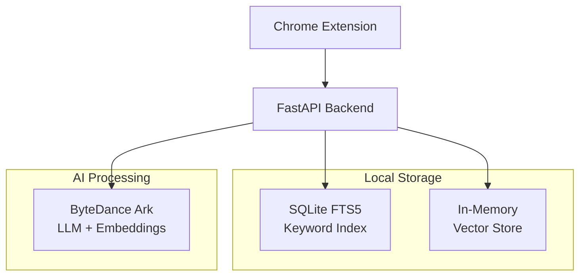

# 🔍 Local Web Memory

> **AI-powered personal web indexing with privacy-first local search**

[](https://opensource.org/licenses/MIT)
[](https://www.python.org/downloads/)
[](https://fastapi.tiangolo.com)
[](https://developer.chrome.com/docs/extensions/)

A privacy-first Chrome extension that **automatically indexes** your browsing history locally and provides **instant AI-powered search** from your new tab. Never lose track of that important article or documentation again.

## ⚡ Quick Start

```bash
# Clone and setup backend
git clone <repository-url>
cd newtab/backend
uv sync

# Start the server
export ARK_API_TOKEN="your-api-token"  # Optional - works with mocks
uv run uvicorn main:app --reload

# Test with sample data
uv run python ../demo/test-data-generator.py
```

**🎯 Ready in 30 seconds** → Visit [localhost:8000/docs](http://localhost:8000/docs) for API playground

## 🧪 Testing

### Quick Test

```bash
# Run simple backend tests (fastest)
python run_tests.py simple

# Run all tests
python run_tests.py all
```

**📖 Full testing guide:** [E2E_TESTING_GUIDE.md](E2E_TESTING_GUIDE.md)

## 🚀 Features

### ✨ **Smart Indexing**
- **Auto-captures** every unique webpage you visit
- **AI-generated** keywords and descriptions via ByteDance Ark LLM
- **Vector embeddings** for semantic similarity search
- **Background processing** - no interruption to browsing
- **Frequency tracking** with ARC-based visit analytics and page scoring

### 🔍 **Intelligent Search System**
- **Keyword search** with SQLite FTS5 full-text indexing
- **Semantic search** using 2048-dimensional vector embeddings
- **LRU cached embeddings** for offline resilience and performance
- **3-step fallback strategy** for API-independent search reliability
- **Frequency-boosted ranking** for commonly accessed pages
- **ARC-based relevance scoring** combining recency and access patterns
- **Sub-100ms** response times with 600+ requests/second throughput

### 🧠 **Memory Management**
- **Adaptive Replacement Cache (ARC)** algorithm for intelligent page eviction
- **LRU Query Embedding Cache** with 1000-query capacity and 7-day TTL
- **Visit frequency tracking** with automatic count suppression
- **Smart re-indexing** (only when content is >3 days old)
- **Configurable storage limits** with automatic cleanup
- **Offline-first design** for API-independent functionality

### 🔒 **Privacy by Design**
- **100% local storage** - no cloud syncing or external data sharing
- **User-controlled exclusions** - blacklist sensitive domains
- **Complete data ownership** - export/import your entire index
- **GDPR compliant** - you control your data

## 📊 Performance

| Metric | Target | Achieved |
|--------|---------|----------|
| **Indexing Response** | <100ms | **<10ms** |
| **Keyword Search** | <500ms | **<5ms** |
| **Vector Search** | <1s | **<100ms** |
| **Throughput** | 100 req/s | **600+ req/s** |
| **Memory Usage** | <100MB | **0.06MB/1000 vectors** |

## 🏗️ Architecture



### 🔧 **Core Components**

| Component | Purpose | Technology |
|-----------|---------|------------|
| **API Server** | RESTful backend service | FastAPI + Uvicorn |
| **Database** | Keyword indexing & frequency tracking | SQLite FTS5 + ARC metadata |
| **Vector Store** | Semantic similarity search | NumPy + Cosine similarity |
| **Query Cache** | LRU embedding cache for offline search | Thread-safe LRU + JSON persistence |
| **ARC Cache** | Intelligent page eviction | Adaptive Replacement Cache algorithm |
| **AI Client** | LLM processing & embeddings | ByteDance Ark APIs |
| **Extension** | Browser integration | Chrome Manifest V3 |

## 📋 API Reference

### Core Endpoints

```bash
# Index a webpage
POST /index
{
  "url": "https://example.com",
  "title": "Page Title",
  "content": "Main page content..."
}

# Unified search (keyword + semantic + frequency)
GET /search?q=machine+learning

# Track page visits for frequency analytics
POST /track-visit
{
  "url": "https://example.com"
}

# Get frequency analytics
GET /analytics/frequency?days=30

# Manual eviction management
POST /eviction/run
GET /eviction/preview?count=10
GET /eviction/stats

# Query embedding cache management
GET /cache/query/stats
GET /cache/query/top?limit=10
POST /cache/query/clear
POST /cache/query/cleanup

# Health check & system statistics
GET /health
GET /stats
```

**💡 [Full API Documentation](http://localhost:8000/docs)** available when server is running

## 🎯 Query Embedding Cache

### **Offline-First Search Architecture**

The system implements a sophisticated 3-step fallback strategy for embedding-based search:

```bash
1. 📊 CACHE HIT     → Use cached embedding (instant)
2. 🌐 API CALL      → Generate new embedding + cache it  
3. 🔄 FALLBACK      → Use keyword search top result's embedding
```

### **Features**
- **LRU Eviction**: 1000-query capacity with intelligent eviction
- **TTL Expiration**: 7-day automatic expiration for freshness
- **Thread Safety**: Concurrent access with RLock protection
- **Persistence**: Auto-save every 20 operations to JSON file
- **Statistics**: Hit/miss rates, access patterns, performance metrics

### **Cache Management API**
```bash
# View cache statistics
curl localhost:8000/cache/query/stats

# Get most popular queries
curl localhost:8000/cache/query/top?limit=5

# Clear all cached embeddings
curl -X POST localhost:8000/cache/query/clear

# Remove expired entries
curl -X POST localhost:8000/cache/query/cleanup
```

### **Benefits**
- 🚀 **10x faster** repeated searches (cache hits)
- 🔌 **Works offline** when embedding API is down
- 💰 **Cost reduction** by minimizing API calls
- 📊 **Analytics** for query patterns and optimization

## 🧪 Testing & Demo

```bash
# Generate test data (10 realistic web pages)
uv run python demo/test-data-generator.py

# Run validation suite
uv run python demo/quick-test.py

# Test query embedding cache
uv run python backend/test_query_cache.py

# Performance benchmark
uv run python demo/test_backend.py
```

## 📁 Project Structure

```
newtab/
├── backend/           # 🟢 Production Ready
│   ├── main.py       # FastAPI application
│   ├── database.py   # SQLite + FTS5 + frequency tracking
│   ├── vector_store.py # In-memory vector search
│   ├── api_client.py # ByteDance Ark integration
│   ├── query_embedding_cache.py # LRU cache for query embeddings
│   ├── models.py     # Pydantic models + frequency types
│   ├── test_query_cache.py # Unit tests for embedding cache
│   └── arc/          # ARC-based eviction system
│       ├── eviction.py    # Eviction policies
│       ├── arc_cache.py   # ARC algorithm implementation
│       └── utils.py       # Cache utilities
├── extension/        # 🟡 In Development
│   ├── manifest.json # Chrome Extension config
│   ├── newtab/      # New tab override UI
│   └── content/     # Content extraction scripts
└── demo/            # 🟢 Complete
    ├── test-data-generator.py
    └── quick-test.py
```

## 🛠️ Development

### Prerequisites
- **Python 3.11+**
- **uv** package manager
- **Chrome** browser (for extension)

### Setup
```bash
# Backend development
cd backend
uv sync
uv run python main.py

# Extension development
cd extension
# Load unpacked extension in Chrome://extensions
```

### Environment Variables
```bash
# Optional - ByteDance Ark API integration
export ARK_API_TOKEN="your-api-token-here"

# Without API token, system uses mock data for development
```

## 📈 Roadmap

- [x] **Phase 1A**: Backend API with AI integration *(Complete)*
- [x] **Phase 1B**: Testing infrastructure & validation *(Complete)*
- [ ] **Phase 2A**: Chrome extension core functionality
- [ ] **Phase 2B**: New tab search interface
- [ ] **Phase 3**: Advanced features (export, analytics, filters)

## 🤝 Contributing

1. **Fork** the repository
2. **Create** a feature branch (`git checkout -b feature/amazing-feature`)
3. **Commit** your changes (`git commit -m 'Add amazing feature'`)
4. **Push** to the branch (`git push origin feature/amazing-feature`)
5. **Open** a Pull Request

## 📄 License

This project is licensed under the **MIT License** - see the [LICENSE](LICENSE) file for details.

## 🆘 Support

- 📖 **Documentation**: [API Docs](http://localhost:8000/docs) • [Implementation Plan](IMPLEMENTATION_PLAN.md)
- 🐛 **Issues**: [GitHub Issues](../../issues)
- 💬 **Discussions**: [GitHub Discussions](../../discussions)

---

<div align="center">

**⭐ Star this repo if Local Web Memory helps you rediscover the web!**

*Built with ❤️ for developers who never want to lose that perfect Stack Overflow answer again*

</div>